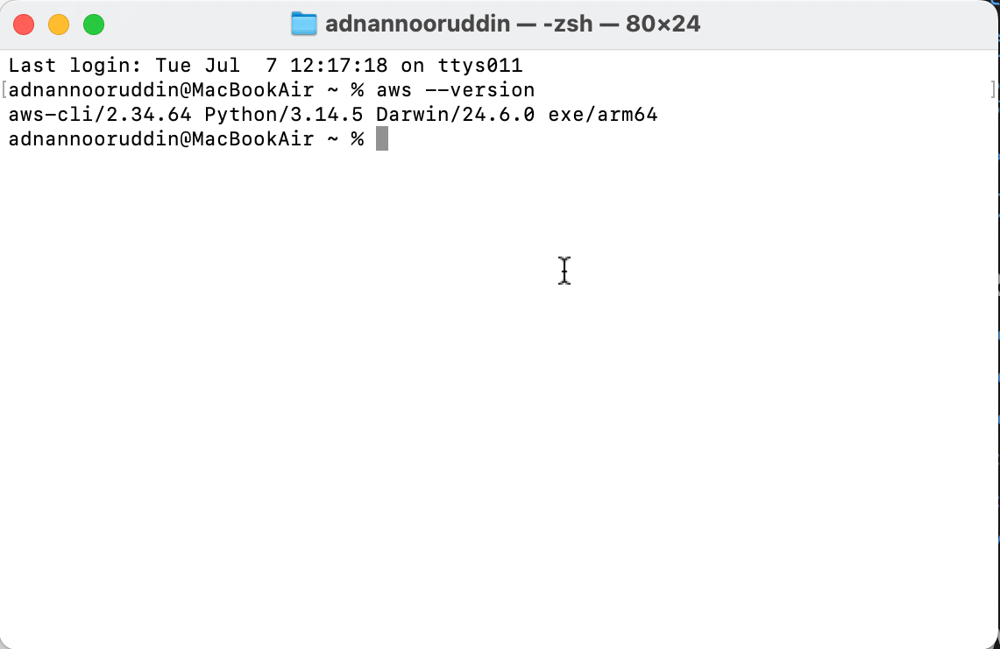
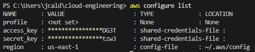
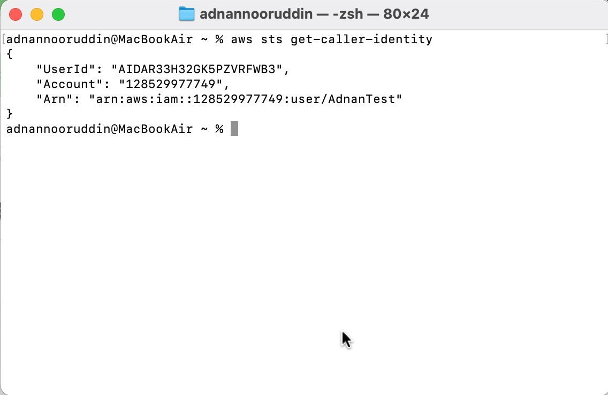
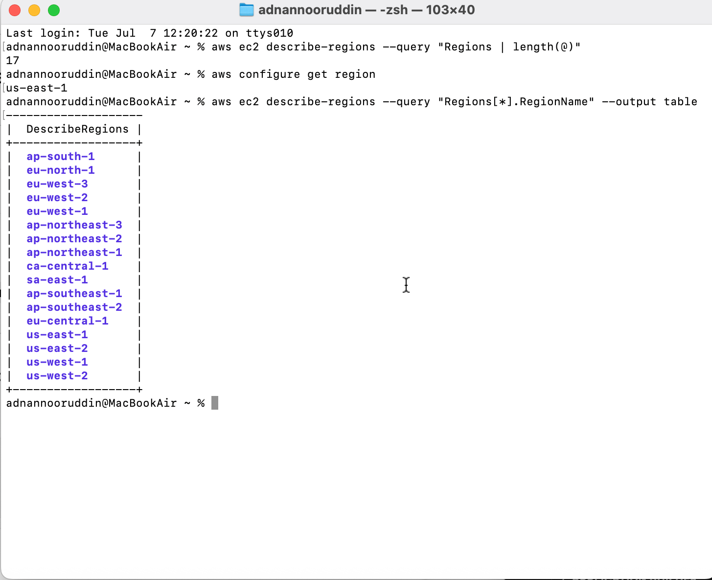
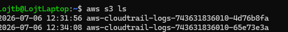
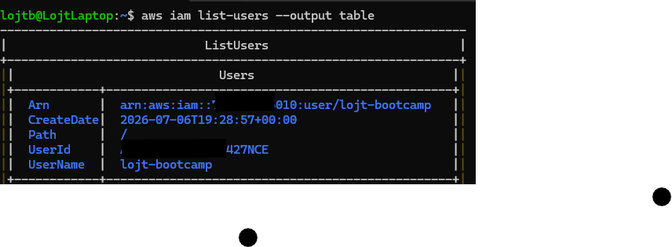
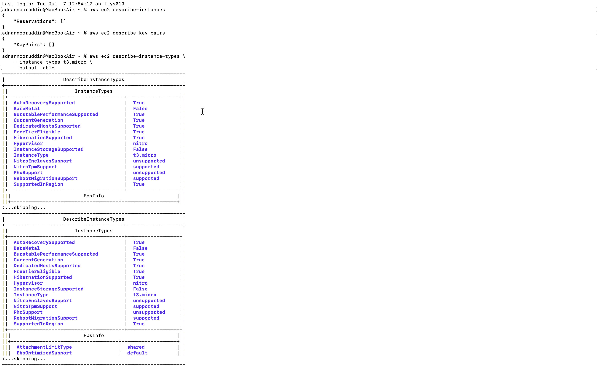
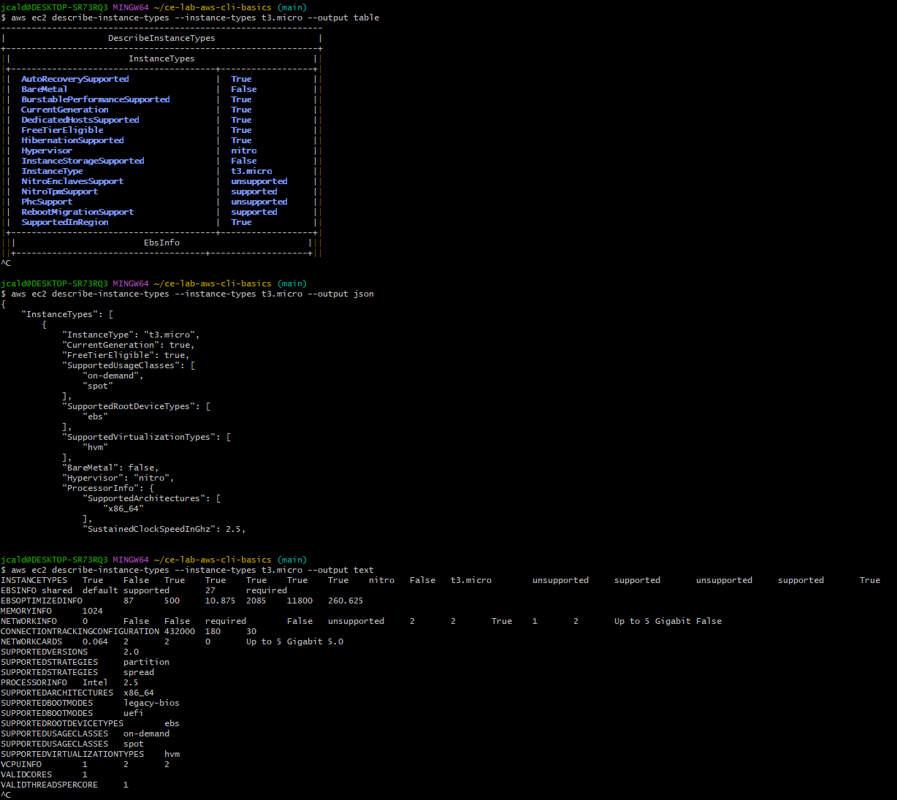

# AWS CLI Basics - Solution

Name:Pragash KUMARAVEL

GitHub Username:pragashkumar14

---

# Task 1 - Verify AWS CLI

## aws --version

```text

```

### Screenshot



---

# Task 2 - AWS Configuration

## aws configure list

```text

```

### Screenshot



---

# Task 3 - Caller Identity

## aws sts get-caller-identity

```text

```

### Screenshot



---

# Task 4 - AWS Regions

Number of Regions:17

Default Region:eu-west-3

Closest Region:  eu-central-1 

### Screenshot



---

# Task 5 - Availability Zones

Number of AZs:6

Why are multiple AZs important? AZ's are important because they provide fault tolerance and high availability.

### Screenshot


---

# Task 6 - S3 Investigation

Buckets:

Reason if none exist:

### Screenshot



---

# Task 7 - IAM Investigation

IAM Users:1 > Admin

Why avoid using the root account? Using IAM users is safer because to the Principle of least Privilege

### Screenshot



---

# Task 8 - EC2 Investigation

Running Instances:No

Key Pairs:  aws test pragash 

Instance Types:t3.micro

### Screenshot



---

# Task 9 - Output Formats

Preferred format:vCPU

Reason:user friendly 

### Screenshot



---

# Reflection
1, aws ec2 describe-instances 
2,--output table
3, AWS CLI is significantly faster for repeatable tasks. Once you have a command structure, you can execute complex queries in seconds, whereas the Management Console often requires multiple clicks and page loads.
...

---

# Bonus

### Screenshot


