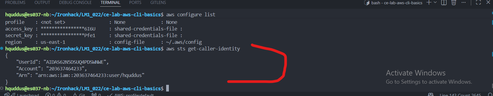
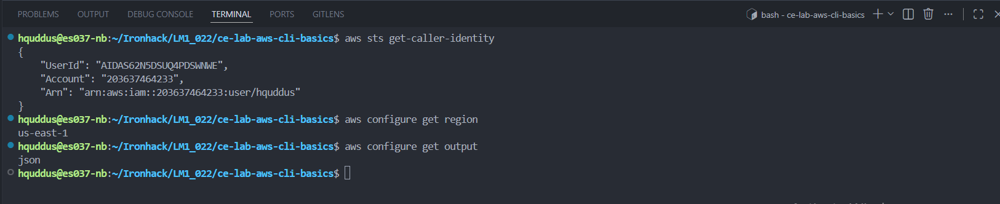
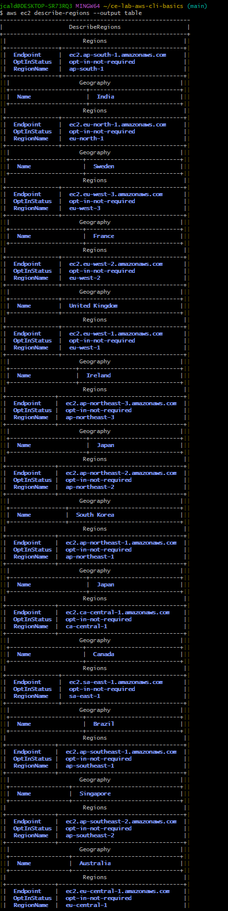
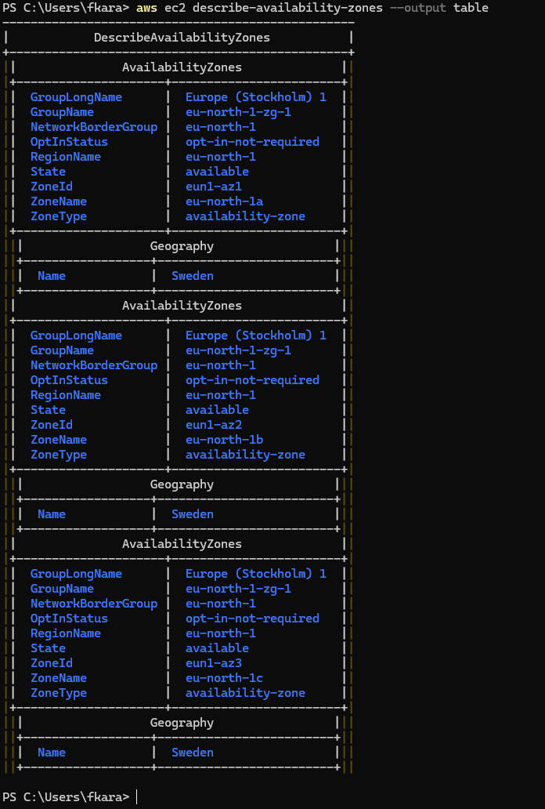
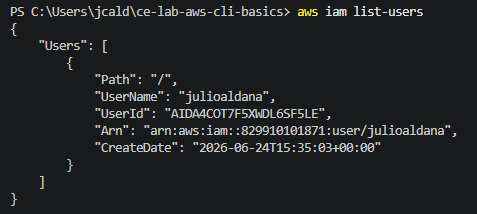
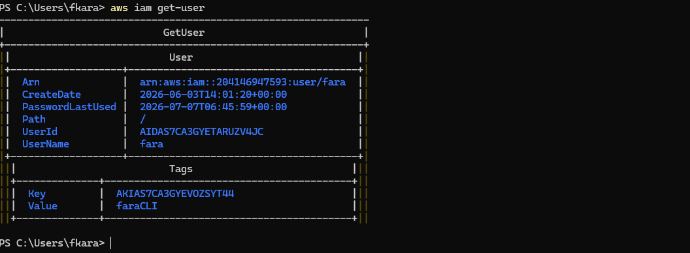
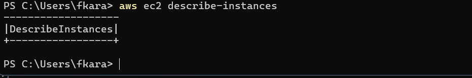
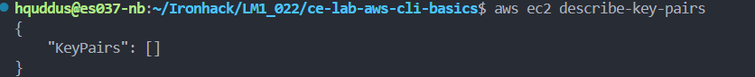
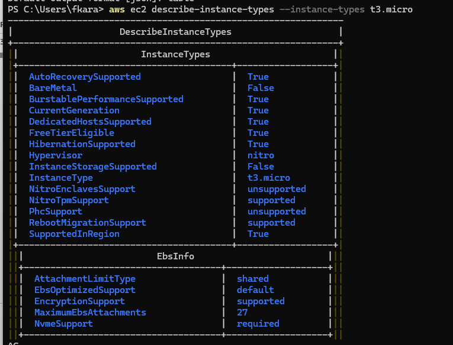

# AWS CLI Basics - Solution

**Name:** Faramarz Karamizadeh

**GitHub Username:** f-karamizadeh

---

# Part 1 – Verify AWS CLI Installation

## Command Output

### aws --version

aws-cli/2.34.60 Python/3.14.5 Windows/11 exe/ARM64

### aws configure list

NAME       : VALUE                    : TYPE             : LOCATION
profile    : <not set>                : None             : None
access_key : ****************YT44     : shared-credentials-file :
secret_key : ****************kVnO     : shared-credentials-file :
region     : eu-north-1               : config-file      : ~/.aws/config

### aws sts get-caller-identity
{                                                                                                                                                                        
    "UserId": "AIDAS7CA3GYETARUZV4JC",
    "Account": "204146947593",
    "Arn": "arn:aws:iam::204146947593:user/fara"
}

### Screenshots

---

# Part 2 – AWS Account Information

Answer the following:

**AWS Account ID:** 204146947593

**IAM User ARN:** arn:aws:iam::204146947593:user/fara

**Default Region:** eu-north-1

**Configured Output Format:** JSON

### Screenshot

---

# Part 3 – AWS Regions & Availability Zones

## Regions

**How many AWS Regions are available?** 17

**Which Region is configured as your default?** Stockholm

### Screenshot

---

## Availability Zones

**How many Availability Zones exist in your current Region?** 3

**Why should production workloads use multiple Availability Zones?** 
Multiple Availability Zones (AZs) are crucial because they prevent a single physical disaster or power outage from taking your entire business offline. High Availability & Fault Tolerance , Redundancy Without High Latency are  exactly why they matter.

### Screenshot

---

# Part 4 – Investigating IAM

**How many IAM users exist?** 1

**Why is using IAM users safer than using the root account?**
The Root account has absolute, unrestricted power that destroys the entire system if compromised; whereas IAM users have limited, trackable permissions that can be easily revoked without affecting the rest of the infrastructure.
### Screenshots

---

# Part 5 – Investigating EC2

**Are there any EC2 instances running?** 1 EC2

**Are any EC2 Key Pairs configured?** Yes

**What information does AWS return for the `t3.micro` instance type?**
---------------------------------------------------------------
|                    DescribeInstanceTypes                    |
+-------------------------------------------------------------+
||                       InstanceTypes                       ||
|+----------------------------------------+------------------+|
||  AutoRecoverySupported                 |  True            ||
||  BareMetal                             |  False           ||
||  BurstablePerformanceSupported         |  True            ||
||  CurrentGeneration                     |  True            ||
||  DedicatedHostsSupported               |  True            ||
||  FreeTierEligible                      |  True            ||
||  HibernationSupported                  |  True            ||
||  Hypervisor                            |  nitro           ||
||  InstanceStorageSupported              |  False           ||
||  InstanceType                          |  t3.micro        ||
||  NitroEnclavesSupport                  |  unsupported     ||
||  NitroTpmSupport                       |  supported       ||
||  PhcSupport                            |  unsupported     ||
||  RebootMigrationSupport                |  supported       ||
||  SupportedInRegion                     |  True       
### Screenshots

---

# Reflection

### 1. Which AWS CLI command did you find most useful?
I think the most useful command was `aws ec2 describe-availability-zones`. Instead of clicking through multiple sub-menus in the AWS Management Console to find topological details, this single command instantly maps out the available infrastructure zones within a region. It is incredibly efficient for a quick health check of the underlying cloud landscape.
---

### 2. Which command output was the easiest to understand?
The output of `aws iam get-user` (or `aws sts get-caller-identity`) was the easiest to parse. Because it returns a clean, highly structured JSON block containing just a few clear key-value pairs—such as the explicit `UserId`, `Account` ID, and the exact user `Arn`—it leaves zero room for ambiguity regarding which identity is currently authenticated in the terminal.

---

### 3. How does using the AWS CLI compare to navigating the AWS Management Console?
**AWS Management Console** is excellent for visual exploration, initial learning, and viewing high-level dashboards. However, it can be slow, requires extensive clicking, and makes repetitive tasks inefficient.
**AWS CLI** is built for speed, precision, and automation. Once you know the specific queries, executing a command takes seconds. More importantly, CLI operations can be easily scripted and integrated into DevOps automation pipelines, making it the preferred choice for managing scalable cloud infrastructure.
---

# Bonus Challenge

**Service Chosen:**

**What does the service do?**

**What problem does it solve?**

**Where do you think it might be used?**
